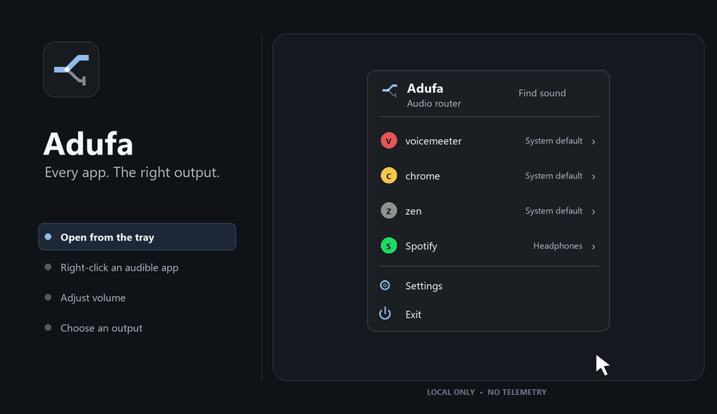

<div align="center">
  
  <h1>Adufa</h1>
  <p><strong>アプリごとに最適なオーディオデバイスへ。</strong></p>
  <p>アプリ単位の音声出力と音量を、すばやくローカルで切り替えるツールです。</p>
</div>

<p align="center">
  <a href="../../README.md">English</a> ·
  <a href="../../README.pt-BR.md">Português (Brasil)</a> ·
  <a href="README.es.md">Español</a> ·
  <a href="README.fr.md">Français</a> ·
  <a href="README.de.md">Deutsch</a> ·
  <a href="README.it.md">Italiano</a> ·
  <strong>日本語</strong> ·
  <a href="README.zh-CN.md">简体中文</a>
</p>

<p align="center">
  <code>Windows ベータ版</code> · <code>macOS 対応予定</code> · <code>Linux 対応予定</code> · <code>GPL-3.0-or-later</code>
</p>


## Adufa を使う理由

ビデオ通話はヘッドセット、音楽はスピーカー、ブラウザーはモニターや仮想ケーブルを
使いたいことがあります。Adufa なら、音を出しているアプリを確認し、それぞれを適切な
出力先へ送れます。毎回 Windows の音量ミキサーを探し回る必要はありません。

Adufa は意図的に小さく設計されています。通知領域に常駐し、作業している場所の近くで
開き、アプリのルートを記憶し、用が済めば邪魔になりません。

## 動作を見る



このアニメーションは、ドキュメント用にネイティブ UI を決定論的に描画したものです。
デスクトップのキャプチャーや個人データは含まれていません。

## 現在利用できる機能

現在の公開ベータ版は **Windows 10 22H2 と Windows 11** で動作します。

- アクティブなオーディオセッションを持つアプリを自動検出します。
- システム既定値を変えずに、1 つのアプリの出力デバイスだけを変更します。
- Adufa やアプリを再起動しても、アプリのルートを記憶します。
- 1 回の選択でアプリを `システムの既定値`（`System default`）へ戻せます。
- アプリごとの現在の音量とミュート状態を変更します。
- 対応する Windows 11 ビルドでは、音を出しているアプリのタスクバーアイコンを右クリックすると、
  ネイティブメニューの横に出力先、音量、ミュートの試験的な操作を開けます。
- 最も大きな音を出しているアプリを一時的に強調表示する **音を探す**（`Find sound`）を搭載しています。
- `Ctrl + Alt + A` でカーソル付近にクイックセレクターを開きます。
- サインイン時に起動できます。この設定は有効にするまでオフのままです。
- 英語、ブラジルポルトガル語、スペイン語、フランス語、ドイツ語、イタリア語、
  日本語、簡体字中国語に対応しています。
- Windows の表示言語を検出し、手動で別の言語を選択できます。
- アカウント、分析、テレメトリー、音声のアップロードなしでローカル動作します。

### 試験的な Windows 統合

対応する Windows 11 ビルドでは、音を出しているアプリのタスクバーアイコンを右クリックすると、
ネイティブのタスクバーメニューの横に Adufa のコンパクトな補助パネルが開く場合があります。
ネイティブメニューはそのまま利用でき、Adufa が音量と出力先の操作を追加します。

この統合では、表示されているタスクバーアイコンとアクティブなオーディオアプリを照合します。
ベータ機能のため、Windows から信頼できる一致情報を得られない場合は、グローバルショートカットや
トレイのポップアップを使用できます。

## ベータ版をインストールする

### ポータブル版をダウンロードする

タグ付きバージョンは GitHub Actions でビルドされます。[Releases ページ](../../../releases)を開き、
`Adufa-Windows-x64.exe` をダウンロードして実行してください。

初期ベータ版の実行ファイルはポータブル形式で、署名されていません。署名済みパッケージが
提供されるまでは、Windows が SmartScreen の警告を表示する場合があります。実行を許可する前に、
このリポジトリの release から取得したファイルであることを確認してください。

### ソースからビルドする

必要な環境：

- Windows 10 22H2 または Windows 11、x64
- MSVC toolchain を含む [Rust](https://www.rust-lang.org/tools/install) 1.85 以降
- **C++ によるデスクトップ開発** と Windows SDK を含む Visual Studio Build Tools

```powershell
rustup target add x86_64-pc-windows-msvc
cargo build --release --locked -p router-windows --target x86_64-pc-windows-msvc
```

実行：

```powershell
.\target\x86_64-pc-windows-msvc\release\router-windows.exe
```

通常の利用には release ビルドを使用してください。release ビルドは Windows GUI アプリケーション
なので、ターミナルウィンドウを開きません。debug ビルドは診断用コンソールを意図的に残します。

## 使い方

### トレイからアプリを振り分ける

1. 振り分けたいアプリで音声を再生します。
2. 通知領域の隠れているアイコンを開き、Adufa を選択します。
3. アプリの行を選択します。
4. 出力先を選ぶか、`システムの既定値`（`System default`）を選んで保存済みルートを削除します。
5. ポップアップの外側をクリックするか `Esc` を押して閉じます。

ルートは一時的なプロセス ID ではなく、安定したアプリ識別情報に対して保存されます。アプリの
再起動後も、プラットフォームが安全に識別できる場合は Adufa が保存済みの選択を復元します。

### 音を出しているアプリを見つける

1. Adufa を開きます。
2. **音を探す**（`Find sound`）を選択します。
3. ライブレベルを確認します。最も強い音源が強調表示されます。
4. そのアプリを選択して出力先を変更します。

音を探す機能は音声を録音しません。Windows がすでに提供しているセッションのピークレベルを
読み取り、コンパクトなポップアップを閉じると停止します。

### タスクバーの補助パネルを使う

1. Windows がオーディオセッションを公開できるよう、対象アプリで一度以上音を再生します。
2. タスクバーにあるそのアプリのアイコンを右クリックします。
3. 隣に表示される Adufa パネルで、ミュート、音量調整、出力先の選択を行います。
4. 出力先を選択すると、補助パネルとネイティブメニューの両方が閉じます。

補助パネルが表示されない場合は、音を出しているアプリをポイントして `Ctrl + Alt + A` を押すか、
通知領域から Adufa を開いてください。

### 言語や起動動作を変更する

**設定**（`Settings`）を開くと、次の操作ができます。

- Windows の言語に従う、または対応言語を手動で選ぶ
- サインイン時に Adufa を起動するかどうかを切り替える
- システム全体の操作用に Windows の音量ミキサーを開く

## キーボードとマウスの操作

| 入力 | 操作 |
| --- | --- |
| `Ctrl + Alt + A` | ポインター下にある音声アプリ用のクイックセレクターをカーソル付近に開く |
| 音声アプリのタスクバーアイコンを右クリック | ネイティブメニューの横に試験的な Adufa パネルを開く |
| `Tab` または `↓` | 次の項目へ移動 |
| `↑` | 前の項目へ移動 |
| `Enter` または `Space` | フォーカス中の項目を実行 |
| `Esc` | 現在のセレクターを閉じる、または設定画面から戻る |
| 外側をクリック | Adufa の一時ウィンドウを閉じる |

別のアプリがグローバルショートカットをすでに登録している場合、このショートカットを利用できない
ことがあります。その場合も Adufa は動作を続け、トレイからの操作を利用できます。

## プラットフォームの対応状況

| プラットフォーム | 状況 | 予定しているバックエンド |
| --- | --- | --- |
| Windows 10 22H2 / Windows 11 | **ベータ版を利用可能** | Windows Core Audio / WASAPI とネイティブ Win32 UI |
| macOS 14.2+ | 対応予定 | Core Audio とネイティブなメニューバー UI |
| Linux、Wayland、X11 | 対応予定 | PipeWire とネイティブなデスクトップ統合 |

クロスプラットフォーム対応は製品の方向性であり、現時点での機能の同等性を示すものではありません。
各バックエンドは対応能力を明示し、未対応のルーティング操作が成功したように見せることはありません。
アイコンと基本的な操作体系は共通ですが、動作と外観は各プラットフォームに合わせます。

## プライバシー

Adufa はローカルのみで動作するよう設計されています。

- テレメトリーや分析はありません。
- ユーザーアカウントはありません。
- 音声の録音やアップロードはありません。
- ルーティングにネットワークサービスは不要です。
- ルートと設定はコンピューター上に保存されます。

Windows では、現在のユーザーのローカルアプリケーションデータディレクトリに設定が保存されます。
ポータブル実行ファイルを削除しても、この設定ファイルは自動的には削除されません。

## ロードマップ

各プラットフォームの実装が実証されるまでは、日程を約束しません。

### 開発中

- 対応する Windows 10 / 11 ビルドで Windows ベータ版をさらに安定化。
- 署名済みインストーラーとポータブル release のチェックサム。
- アクセシブルなラベル、高コントラスト検証、キーボード操作の改善。
- ネイティブ話者による翻訳レビュー。
- 任意で利用でき、プライバシーを保護する信頼性の高い更新確認。

### 次に予定している機能

- アプリと出力先の検索。
- お気に入りの出力先。
- 設定可能なグローバルショートカット。
- 拡張ミニミキサー。
- プロファイルとアプリごとの自動ルール。
- 診断機能の改善と、復元可能なルートの再関連付け。

### 対応予定のプラットフォーム

- Core Audio を使用する macOS 14.2+。Apple Silicon と Intel の両方へ配布予定。
- Wayland / X11 上で PipeWire を使用する Linux。PulseAudio 専用バックエンドは
  最初の Linux リリースには含まれません。

### 検討中

- OS が安全な API を提供する場合の、より深いネイティブメニュー統合。
- 音声や活動データをアップロードしない、任意の設定同期。
- 仕事、ゲーム、通話、配信用の複数デバイスセットと再利用可能なプロファイル。

## トラブルシューティング

### アプリが表示されない

音声を再生して Adufa を開き直してください。一部のアプリは音を出すまでオーディオセッションを
作成しません。保護されたセッションやシステム所有のセッションでは識別情報が少なく、別の
グループ化されたアプリとして表示される場合があります。

### 保存した出力先を利用できない

Adufa は、似た名前のデバイスへ暗黙に置き換えず、希望したルートを保持します。同じデバイスを
再接続するか、別の出力先または `システムの既定値`（`System default`）を選択してください。

### タスクバーの補助パネルが開かない

この統合は試験的で、タスクバーアイコンと音を出しているアプリを一意に照合できる必要があります。
グローバルショートカットまたはトレイのポップアップを試してください。Windows 10 では、
Windows 11 でのみ安定して動作する統合に対して代替操作を使用します。

### `Ctrl + Alt + A` を押しても何も起きない

別のプログラムがそのグローバルショートカットをすでに登録している可能性があります。トレイから
Adufa を開いてください。ショートカットのカスタマイズはロードマップに含まれています。

### ターミナルウィンドウが表示される

debug ビルドを実行しているか、`cargo run` で起動している可能性があります。
[ソースからビルドする](#ソースからビルドする)に示す release 実行ファイルをビルドして起動してください。

## 開発

```powershell
cargo fmt --all -- --check
cargo clippy --workspace --all-targets --all-features -- -D warnings
cargo test --workspace
```

実際の Windows オーディオセッションを往復するテストは、実セッションを一時的に変更するため、
既定では無視されます。アクティブで失っても問題のないオーディオセッションがある開発マシンでのみ
実行してください。

リポジトリの構成：

- `crates/router-engine`：プラットフォーム非依存の識別情報、コマンド、状態
- `platforms/windows`：Windows オーディオ、永続化、タスクバー統合、ネイティブ UI
- `docs/adr`：承認済みのアーキテクチャ判断
- `docs/design`：操作とアイデンティティの調査
- `docs/assets`：生成したドキュメントとブランド用アセット

CI ワークフローは書式、Clippy、テストを検証し、Windows x64 のポータブル実行ファイルを生成します。
`v0.1.0-beta.1` のようなタグを push すると GitHub Release が作成され、
`Adufa-Windows-x64.exe` が添付されます。

## コントリビューション

不具合報告には、Windows のバージョン、対象アプリ、期待した出力先、実際の出力先、トレイ・
ショートカット・タスクバーのどの操作を使用したかを記載してください。録音、設定ファイル、
個人用パスを含むログは、内容を確認せず添付しないでください。

コントリビューションでは、安定したアプリ識別情報、イベント駆動の監視、対応能力の正確な表示、
プラットフォームネイティブの UI、テレメトリーなし、という基本原則を維持してください。

## ライセンスと名称

ソースコードは Cargo workspace の宣言どおり **GPL-3.0-or-later** でライセンスされています。
「Adufa」とプロジェクトのアートワークは公式ビルドを識別するものであり、オープンソースライセンスは
改変された配布物を推奨するものではありません。

名称について実施済みなのは、Web とリポジトリでの予備的な競合調査のみです。これは法的な商標調査
ではありません。公式配布の前に、対象地域で正式な調査を完了する必要があります。

---

<p align="center"><strong>Adufa</strong> — デスクトップに隠れた音の経路を操作する、小さなコントロールサーフェス。</p>
